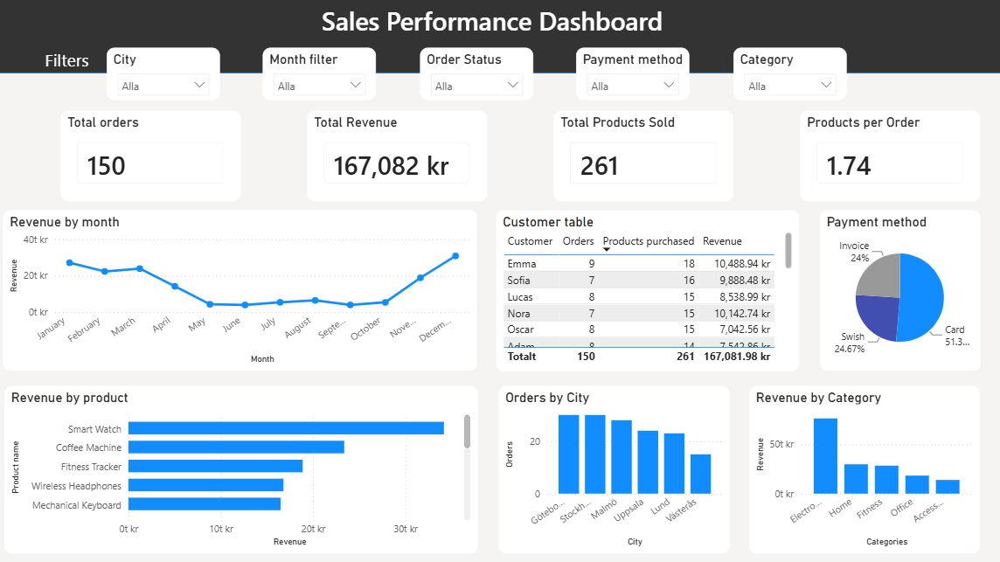

# Sales Performance Dashboard

An interactive sales dashboard built in Power BI using a PostgreSQL database. 
In this project I created a database, analysed data with SQL and presented the insights in Power BI.

The purpose of this project was to practice Business Intelligence and data analysis by building a sales dashboard from scratch.
The dashboard gives an overview of sales performance, products, customers and revenue through interactive charts, KPIs and 
filters.

# The Dashboard Answers Questions Such As

- Which product category generates the most revenue?
- Which city has the most and the fewest orders?
- How does revenue change over time?
- What are the total sales, number of orders and products sold?

# Technologies Used:

- Power BI
- PostgreSQL
- SQL
- DAX

# Data Source

The dataset was created for this project.
It contains a relational database with:
- 20 customers
- 15 products
- 150 orders

The data was designed to simulate a small sales business.

# Dashboard Features:

- KPI cards
- Revenue analysis by month, product and category
- Customer and city analysis
- Slicers
- Tooltips
- DAX measures

# Dashboard Preview

Screenshot of the dashboard:

